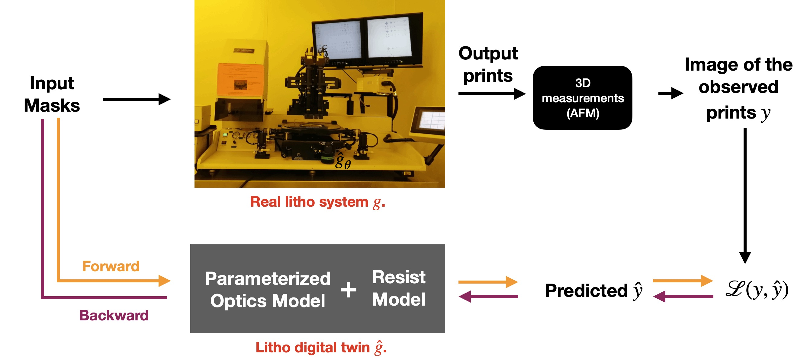

# Neural Lithography

Repo for the project - **Neural Lithography: Close the Design to Manufacturing Gap in Computational Optics with a 'Real2Sim' Learned Photolithography Simulator**
#### [Project Page](https://neural-litho.github.io/) | [ArXiv](https://arxiv.org/abs/2309.17343)|  [Bibtex](#bibtex)
[Cheng Zheng](https://zcshinee.github.io/chengzheng.github.io/)\* $^{1}$, [Guangyuan Zhao](https://twitter.com/guangyuan_zhao)\* $^{2}$, [Peter So](https://meche.mit.edu/people/faculty/ptso@mit.edu) $^{1}$. (*equal contribution)<br>
$^1$ MIT, $^2$ CUHK.

:pushpin: Related paper accepted to [SIGGRAPH ASIA 2023](https://asia.siggraph.org/2023/submissions/technical-papers/).


--------------
## What We Contribute?

**TL;DR:** :one: A real2sim pipeline to quantitatively digitalize a real-world lithography system into a high-fidelity neural lithography digital twin; :two: A fully-differentiable bi-level design-manufacturing co-optimization framework to bridge the design-to-manufacturing gap in computational optics. 

### This work answers two fundmental questions in computational optics (including computational lithography):
1. *What is the "elephant in the room" in Computational Lithography?*
  - **High-fidelity photolithography simulator.** | "No matter how good we can advance the computational (inverse) lithography algorithm, the performance bound is grounded in the fidelity of the lithography simulator."  
2. *What hinders the progress of computational optics?*
  - One should be the **Design to Manufacturing gap**. | "Yes you can design a perfect lens, but you cannot guarantee the post-manufacturing performance." 


### Accordingly, our work tackles the above questions and opens up two exciting research directions:

1. Real2Sim learning for 3D modelling the fabrication outcome of any real-world photolithography system.


2. Close the Design-to-manfuctuting gap via co-optimizing the manufacturiability and the task design with two intersected differentiable simulators (Litho + Task).

<!-- *t* -->
-----------------------------------------
## How to Use this Repo?
See details in [Code.md](Code.md).

## Citation

If you find our work or any of our materials useful, please cite our paper:
```
@article{zheng2023neural,
            title={Neural Lithography: Close the Design-to-Manufacturing Gap in Computational Optics with a'Real2Sim'Learned Photolithography Simulator},
            author={Zheng, Cheng and Zhao, Guangyuan and So, Peter TC},
            journal={arXiv preprint arXiv:2309.17343},
            year={2023}
            }
```